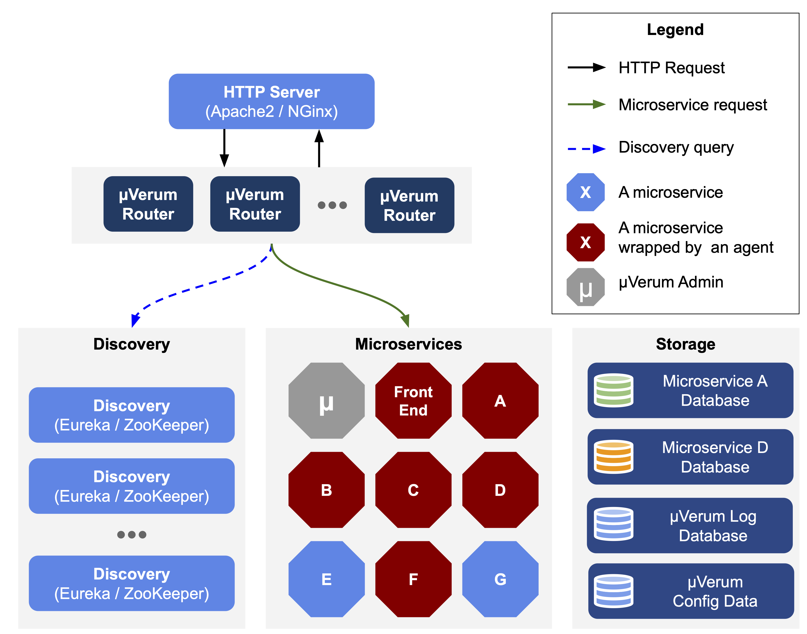

# microVerum

This is the repository with the microVerum code.
MicroVerum consists in a recovery approach for micro-services applications.
It is composed by three component: microVerumBubble, microVerumRouter and microVerumAdminConsole.




## Getting Started

These instructions will get you a copy of the project up and running on your local machine for development and testing purposes. See deployment for notes on how to deploy the project on a live system.

### Prerequisites

 * Install Docker - ([more info](https://docs.docker.com/get-docker/));
 * Install Docker Compose - ([more info](https://docs.docker.com/compose/install/)).


## Running microVerum

There are three docker-compose files that allow to automatically start the components of microVerum and a microservices application ([SockShop](https://github.com/microservices-demo/microservices-demo)) for testing.

Test microVerum with a single agent:
```
docker-compose -f docker-compose-single-service.yml up
```

Test microVerum with the SockShop app:
```
docker-compose -f docker-compose-sockshop-verum.yml up
```

Test the SockShop app:
```
docker-compose -f docker-compose-sockshop.yml up
```

To run the performance tests please install jMeter and load the test cases in `./experiments`. More information [here](https://jmeter.apache.org/usermanual/get-started.html).


## Built With

* [Docker](https://docs.docker.com)
* [Spring Boot](https://spring.io/projects/spring-boot)
* [Maven](https://maven.apache.org)

## Authors

* **David Matos** - *Development of the tool* - [GitHub](https://github.com/davidmatos)

## License

This project is licensed under the MIT License - see the [LICENSE.md](LICENSE.md) file for details

## Acknowledgments

* **[Prof. Miguel Correia](https://github.com/mpcorreia)**
* **[Prof. Miguel Pardal](https://github.com/miguelpardal)**
* **[Prof. António Rito Silva](https://github.com/ritosilva)**
